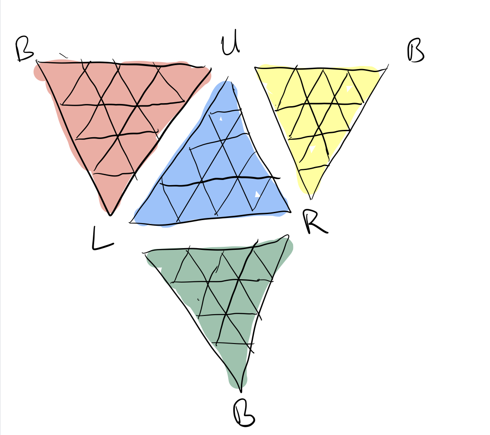
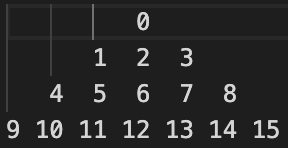
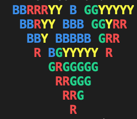

# README
Modeling the (Master) Pyraminx

Isaac Rowe, University of Kentucky

CS463G Fall 2020

### Author's Notes

This document will briefly describe how the desired behavior is implemented.
This document is written in Markdown style, which can be read in its raw text
form or rendered with header and list styling. If you prefer to read with the
rendered styles, you can open this file in an editor/viewer that supports it, or
you can use a utility such as pandoc to convert to the format of your choosing. 

## Puzzle Description
The master Pyraminx is a puzzle similar to the Rubik's Cube, but is a
tetrahedron rather than a cube. There are 4 triangular faces each with 4 layers
of smaller triangle pieces that rotate about the axis through each corner.

## How to run
To build this program, ensure you have a C++ compiler that supports C++11. Run
`make run` to build and run the program. When the program is launched, enter a
command of the form AX[\`] where A is the letter corresponding with a corner of
the Pyraminx (U, L, R, B),  X is a integer from 0-3 specifying the layer of the
row relative to the tip (layer 0) at the corner given, and the optional \` mark
indicates whether the layer should be turned counterclockwise. The default
rotation is clockwise. The corner characters are case insensitive. There should
be no spaces in your command. Enter 's' to scramble, 'q' to quit. Use `make test`
to run the program with example input in `test_input`.

This has been successfully tested with the Apple clang version 11.0.3 compiler
on a x86_64-apple-darwin19.5.0 architecture.

## Notation Convention
The assignment specifies "To make a move, you should specify the face that is
rotated and the direction of rotation." This language does not account for all
the types of moves possible with the Pyraminx, so moves are specified by the
layer that is rotated and the direction of rotation. This interpretation was
supported by comments made in lecture by Dr. Goldsmith in response to a
question.

In order to create a standard notation for making moves, I have defined a a
standard view. This is consistent with techniques used in the twisty-puzzle
community, where the puzzle stays fixed with one side towards the solver for the
duration of a solving stage. 

We imagine always viewing the Pyraminx such that the blue face (Go Cats!) is
always facing us. The corners are therefore fixed and referred to as U, L, R, or
B (Upper, Left, Right, Back). To make a turn, the user specifies the corner, and
the layer, which is counted up from zero starting with tip layer at the corner
specified. The layer is turned clockwise from the perspective of of a viewer at
the specified corner tip, or counter-clockwise if the user appends a tick (\`)
to the end of the turn to specify an inverted turn. Each turn is 120 degrees.

See the image `standard_view.jpg` for a visual aid or read the text description
below. 


**Standard view, unfolded**: Blue in middle, point up. Left side shares an edge
with red, right side shares an edge with yellow, bottom side shares an edge with
green. Top point labeled U, bottom point labelled L, right point labelled R.
Exterior points of unfolded pyramid all labelled B. Layers are labelled 0-3
starting at each tip.

## Data Structure
The source code is organized according to the object-oriented programming (OOP)
paradigm. There are 2 main classes: `Pyraminx` and `Face`. Pyraminx is a data
structure representing the puzzle as a whole. It has 4 members with pointers
`Face` objects corresponding to the faces of the puzzle. It provides the
functions `print()`, which prints the puzzle's current configuration,
`turn_layer()`, which enacts a user-specified move, `scramble()`, which sets the
puzzle to a random (solvable) state, and `setNeighbors()`, which establishes the
relationship between the faces. 

Each `Face` object contains information about the colors and their positions on
that particular face of the puzzle, which is fixed about a center piece. There
are a few main pieces of data managed by the `Face` class, the simplest and most
important of which is `color_data`, an array of `Color` enums (which enumerate the possible
colors). The array is mapped to the physical positions according to the figure
in `mem_layout.png`, where the number shown is the index in the array. The zero
index is always at the "reference corner", which for the blue, red, and yellow
faces is U (Upper), and for green is B (back, since it has no upper corner).
This allows us to have a canonical reference to repeatably use to keep track of
colors on a face.

**Memory Layout**:
```
               0
            1  2  3
         4  5  6  7  8
      9 10 11 12 13 14 15
```


A slightly more complex data structure inside each `Face` object is the
`current_state` map. Each position on a face can be referred to by 3 separate
name (consider that index 0 in the blue face's color_data can be called U0,0;
L4,6; or R4,0).  When a `Face` is initially constructed, this map is filled with
all the possible position names as keys, and pointers to the corresponding spot
in `color_data` as values. This allows for the `Pyraminx` class not not have to
manipulate `color_data` directly, but just refer to the parts of the face it
needs for a certain turn. The class `Eq_Pos_Table` is used to help build this
map.

Each `Face` has a member called `neighbors`, which is a set of pointers to the
`Face`s it borders. These are defined relative to the tip of each face. At each
tip on a face (3 from the set U, L, R, B), there will be a left neighbor and a
right neighbor. Left and right are defined as if the face was viewed straight-on
at an orientation with the tip in question at the top. There are 8 possible
types of neighbors, but a given face will only have 6.

For example, the blue face has the following neighbors:
```
        U_neighbor_left: Red
        U_neighbor_right: Yellow
        L_neighbor_left: Green 
        L_neighbor_right: Red 
        R_neighbor_left: Yellow
        R_neighbor_right: Green
```
The neighbors for the other faces can be easily determined by looking at the
layout of the cube provided. The `Pyraminx` class uses these neighbors in find
the adjacent set of colors when it shifts them between faces during a turn.

Finally, the `Face` class holds 2 arrays, `cw_rotation`, and `ccw_rotation`,
which are used to update the values of `color_data` when the entire face (as
opposed to just a row) is rotated. This occurs when a turn is specified for
layer 3 from the opposite corner. These arrays simply contain an entry for each
position with the index of the position in the old `color_data` array that it
should be updated to match. The values are as follows:
```
int cw_rotation[16] = { 9, 11, 10,  4, 13, 12, 6,  5,  1, 15, 14, 8, 7, 3,  2, 0};
int ccw_rotation[16] = {15,  8, 14, 13,  3,  7, 6, 12, 11,  0,  2, 1, 5, 4, 10, 9 };
```

## Heuristic

A possible admissible heuristic for use in solving this puzzle is suggested
here. First, we must count all the out of place pieces. The term "piece" here is
distinct from the concept of a face position as described in the data structure,
because on the physical cube, faces from adjacent sides can both be on the same
three-dimensional piece (a small tetrahedron with 2 or 3 faces exposed). We can
classify these pieces four ways:  4 centers (one face exposed, fixed), 24
interior pieces (one face exposed, movable), 12 edge pieces (two faces exposed),
and 4 corner pieces (three faces exposed). We optimistically assume that each
piece is only one move away from its correct location. Therefore, for each type
of piece, we divide the number that are out of place by the maximum number that
can be moved in one turn. In this case, it is a level 3 or "base" turn that
rotates an entire face. This moves 3 corners, 6 edges, and 9 interiors. We then
sum the integer floor of these values to get our heuristic. It is worth noting
that in such a turn, the interior pieces on the face being rotated (the base) do
not actually change faces, which means if they are out of place, they will not
be returned to the correct location. Therefore, they are not counted in the
divisor.

To make the case that the heuristic is admissible, we can look at the worst
case. If we assume every (non-corner) piece is out of place, then our heuristic
value is `floor(4/3) + floor(24/9) + floor(12/6) = 5`. However, it is clearly
impossible for all pieces to be both out of place and remain one move away from
the correct location, as the property that give twisty puzzles their allure is
that making one move will disturb the states of the previously correct pieces.
For example, consider the case where every piece is out of place. We make one
layer 3 twist to optimistically put 18 pieces back into place. If we make
another "maximum-displacement" layer 3 twist, we are guaranteed to displace at
least 1 previously-solved piece (at best just the corner, at worst an entire
shared edge), no matter what move we choose. Furthermore, we will need to make
turns that do not move the maximum number of pieces (layer 0, 1, and 2 twists),
which move fewer pieces than the layer 3 turns. Therefore, this heuristic will
never overestimate the number of moves (turns) remaining to reach a solved
state. The downside is that it is not very specific, having only a maximum value
of 5.

This is easily implementable, but some modification to the current data
structure is needed to be able to calculate this. Currently each face is only
aware of the correct color positions on itself, and can therefore only calculate
the interior pieces that are out of place. The overarching Pyraminx class will
need to have a function added that looks at multiple faces to determine if the
edge pieces and corner pieces are out of place.

## GUI
In addition to the input interface described above, this program provides a
basic graphical output, which simply prints an unfolded view of the puzzle to
the terminal. This allows the user to see the state of the puzzle after each
step. The terminal to which output is written must support ANSI color codes. To
check if your terminal supports this, run `tput colors`. The value returned
should be at least 8 for the coloring to work. If you see garbage characters
printed to the output, your terminal probably doesn't support this.

You can see an example of the visualization in the file `GUI_Output.png`. This
shows the state of the puzzle after the moves B3, R0, U3.



It can be difficult to read diagonal layers, since unlike interlocking
triangles, characters must exclusively occupy their own discrete space. Future
work may include a 3D visualization of the puzzle to mitigate this issue.

## Randomizer

The randomizer is implemented in the Pyraminx.scramble() routine. It takes an
integer argument, which is how many random moves to apply. It is implemented
with the C++ Standard Library uniform number distribution and random number
generator. Three different random integers are generated: one in the range [0,3]
for the corner, one in the range [0,3] for the layer, and one in the range [0,1]
for the direction. The corresponding move is then applied. Entering `s` in the
interactive program will run this function for 20 moves. More work is needed to
determine if this is an appropriate value for true randomness, but to the
untrained eye, the puzzle appears to be in a random state.

## Learning outcome

There are a few things I learned from working on this assignment.
1.  **Taking an ambiguous specification and turning it into a working program**: There was a lot of freedom given to us in how we chose to implement our projects, and I needed to make informed decisions on the tradeoffs of various approaches such as class structure and libraries to use.
2. **Documentation**: I spent a lot of time trying to describe my approach in plain English, which proved to be harder than I expected.
3. **Heuristic functions**: I ended up using a heuristic very similar to the one we spoke about in class, but I had to think very carefully about how to justify its admissibility in a rigorous way. I feel much more confident in my ability to evaluate the admissability of a heuristic function after this exercise.
4. **Time Management**: This project took about twice as long as I expected it to. I should probably get used to that at some point.